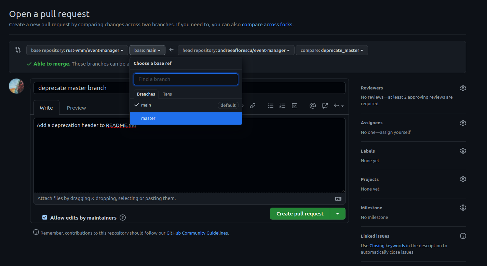

# Rename Master to Main

This guide does a walk through for renaming the master branch of rust-vmm
repositories to main.

A drop-in rename from master to main is not the desired approach as it might
break rust-vmm customers consuming crates from GitHub. The preferred way is
to create a main branch (using the commits from master), set the main branch
as the default repository branch, and mark the master branch as deprecated.

## Prerequisites

- Only rust-vmm maintainers and crate maintainers have permissions to rename
  the branch.

## Create a main branch

In this example, we assume that the repository URL is `${GIT_REPO}`, and we
work with the name `upstream` to define the rust-vmm remote.

1. Clone the repository for which you want to rename the branch.
   
```bash
git clone ${GIT_REPO}
cd ${REPO}
```

If you already have the repository cloned, don't forget to update your local
branch using the upstream branch.

```bash
# Upstream is the rust-vmm remote; this might be called origin for you locally.
# Make sure that remote points to rust-vmm.
git pull upstream master
```

2. Create a local `main` branch.

```bash
git checkout -b main
```

3. Push the branch upstream

```bash
git push -u upstream main
```

## Set Main as Default Branch

The default branch is the one used by the CI, and also the one against which
PRs are opened by default.

To set main as the default branch, you need to go to the GitHub repository
Settings -> Branches -> Click on the switch button right of `master` ->
Choose another branch to use as the default branch of rust-vmm/repo instead of
master: -> Select `main` -> Click on `Update` button.


## Mark Master as Deprecated

To mark the master branch as deprecated we need to add a deprecated badge
in the README.md.

NOTE: At the time when this documentation was created there was no way to mark
a whole crate as deprecated if the crate was not already published on
crates.io.

```bash
# Create a new local branch which is used for deprecating the master branch.
git checkout -b mark_deprecated
```

Write the following at the beginning of the README.md file:

```
## :exclamation: Deprecated :exclamation:

This branch is deprecated! If you want to consume this crate, use a published
version from crates.io, or the main branch (unstable) if a release is not
available.
```

Add the changes to a commit, and push it in your fork:

```bash
git add README.md
git commit -s -m "deprecate master branch"

# We assume that origin points to your fork
git push -u origin mark_deprecated
```

:exclamation: Make sure to change the branch against which you open the PR:


